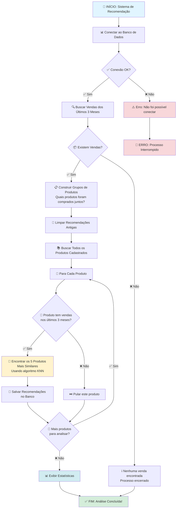
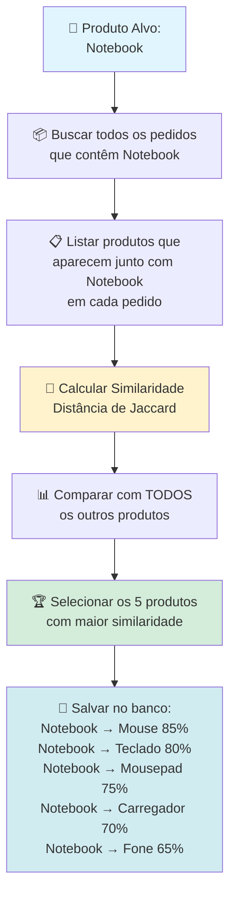
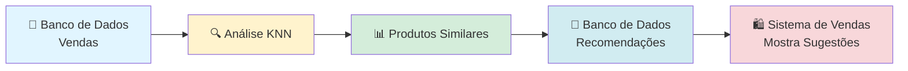

# Fluxograma - Sistema de Recomendação de Produtos (KNN)

## Como Funciona o Sistema de Recomendação

Este fluxograma explica de forma simples como o sistema identifica produtos que costumam ser comprados juntos, como quando você vai ao supermercado e o caixa sugere "clientes que compraram isso também compraram aquilo".

---

## Fluxograma Principal



---

## Exemplo Prático: Como Funciona na Prática

### Cenário: Você compra um Notebook

```mermaid
flowchart LR
    A[👤 Cliente compra<br/>📱 Notebook] --> B[🛒 Sistema registra:<br/>Notebook + Mouse + Teclado<br/>no mesmo pedido]
    B --> C[📊 Após 3 meses,<br/>sistema analisa padrões]
    C --> D[🔍 Algoritmo KNN identifica:<br/>Quem compra Notebook<br/>também compra Mouse]
    D --> E[💡 Recomendação criada:<br/>Notebook → Mouse<br/>Similaridade: 85%]
    E --> F[🛍️ Próximo cliente que<br/>ver Notebook verá:<br/>"Clientes também compraram: Mouse"]

    style A fill:#e1f5ff
    style E fill:#fff3cd
    style F fill:#d4edda
```

---

## Detalhamento do Algoritmo KNN



---

## Fluxo de Dados Simplificado



---

## Analogia: Como um Vendedor Experiente

Imagine que você tem um vendedor muito experiente que:

1. **Observa** todas as compras dos últimos 3 meses 👀
2. **Identifica padrões**: "Quem compra X também compra Y" 📝
3. **Aprende** quais produtos combinam bem juntos 🧠
4. **Sugere** produtos relacionados quando você escolhe algo 🗣️
5. **Atualiza** suas sugestões a cada 3 meses para manter relevância 🔄

O sistema KNN faz exatamente isso, mas de forma automática e precisa!

---

## Resultado Final

Após a análise, o sistema terá:

- ✅ **Recomendações salvas** para cada produto
- ✅ **Top 5 produtos similares** para cada item
- ✅ **Percentual de similaridade** entre produtos
- ✅ **Dados atualizados** a cada execução

**Exemplo de resultado:**

```
Produto: Notebook
├── Recomendação 1: Mouse (85% similaridade)
├── Recomendação 2: Teclado (80% similaridade)
├── Recomendação 3: Mousepad (75% similaridade)
├── Recomendação 4: Carregador (70% similaridade)
└── Recomendação 5: Fone de Ouvido (65% similaridade)
```

---

## Estatísticas Exibidas

Ao final do processo, o sistema mostra:

- 📊 Total de vendas analisadas
- 🏷️ Quantidade de produtos únicos encontrados
- ⏱️ Tempo total de processamento

---

_Este fluxograma foi criado para facilitar o entendimento do sistema de recomendação baseado em KNN (K-Nearest Neighbors)._
